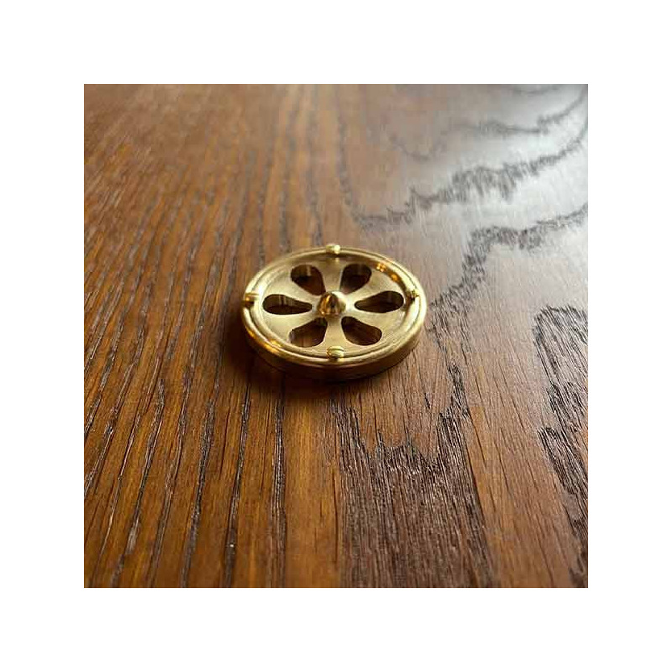

# Lüftungsrosette 4

Formschöne Lüftungsrosette für Vertäfelungen.
Messing gefräst, Oberfläche geschlichtet

Durchmesser 45 mm
Höhe ca. 4 mm

## Technische Daten

- Referenz: BLR 4
- Preis: 41,18 €
- Verfügbar: 1
- Kategorie: Lüftungsrosetten
- Sortierung: nan

## Varianten

    []

## Bilder

## SEO-Metadaten

- meta_title: blr4 – Formschöne Lüftungsrosette für Vertäfelungen.M
- meta_description: Formschöne Lüftungsrosette für Vertäfelungen. Messing gefräst, Oberfläche geschlichtet. Durchmesser 45 mm. Höhe ca. 4 mm.

## Tags

_keine Tags hinterlegt_
