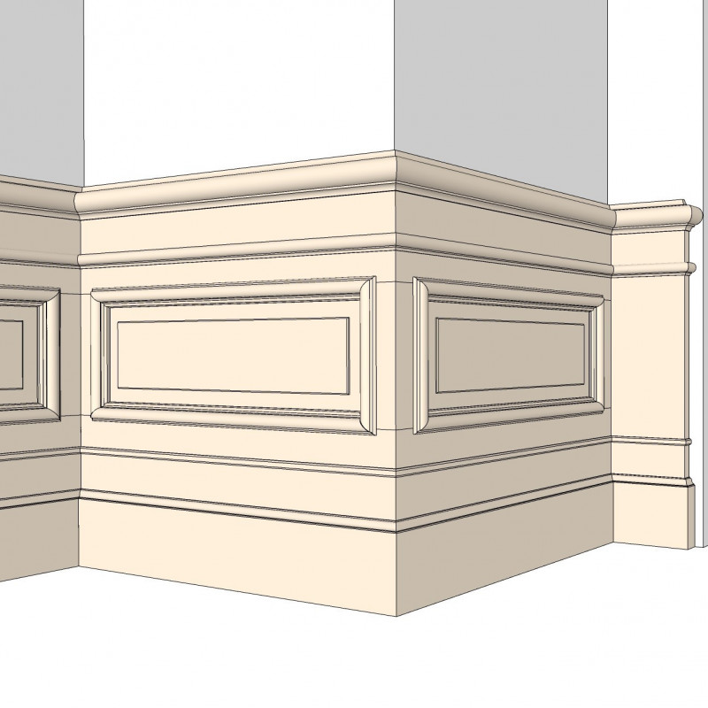

# P0001 - Berlin - Winsstraße

The Wins quarter around Winsstrasse in Berlin Prenzlauer Berg is a residential area with a high quality of life. The atmosphere is characterised by street cafés, book and wine shops and the well-preserved old buildings also contribute to the cosy atmosphere. The stucco-decorated entrances are very varied. There are Art Nouveau tiles, marble and wood panelling like this one.  This wainscoting has an original height of 110 cm and strong profiles with long, horizontal picture-frame-mouldings, which can be easily adapted to individual room dimensions. We manufacture the panel in oak or pine. On request, it can be prepared for a coat of coloured paint.

## Technische Daten

- Referenz: P0001
- Preis: 526,79 €
- Verfügbar: 1
- Kategorie: Artikel, Halbhohe Vertäfelungen
- Sortierung: 

## Varianten

  - bezeichnung: Kiefer, Bausatz
    preis_aufschlag: 0,00 €
  - bezeichnung: Eiche, Bausatz
    preis_aufschlag: 365,78 €

## Bilder

## SEO-Metadaten

- meta_title: P0001 - Berlin - Winsstraße
- meta_description: “Berlin Winsstr.” paneling – half-height wall paneling in historicist style. Pine wood kit for elegant interiors and classic Gründerzeit renovations.

## Tags

_keine Tags hinterlegt_
