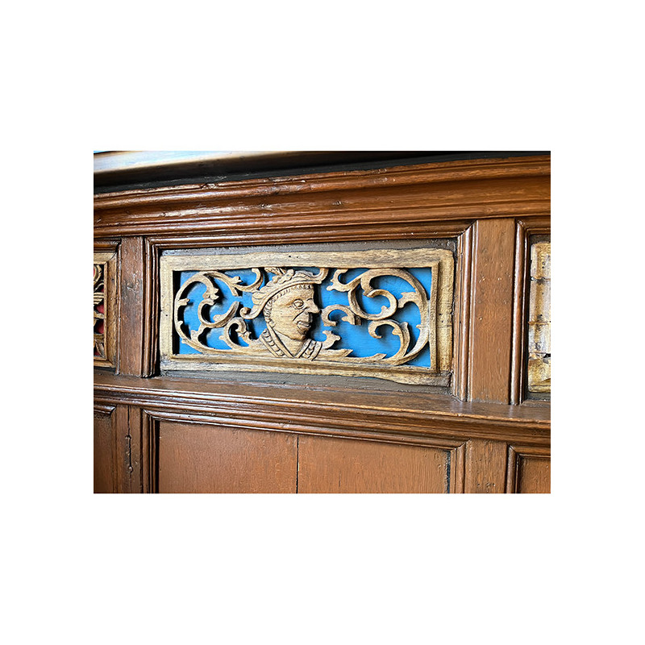

# P0014 - Lübeck - Schiffergesellschaft

The Schiffergesellschaft Lübeck has existed since 1401. The interior is richly decorated with ship models and items that Lübeck captains have collected on their voyages over centuries.
This paneling is typical for Lübeck. A similar structure with a flat field with carvings in the upper area and two upright coffers in the lower area can also be found in the Jakobi- and Aegidienkirche. However, the carvings of the Schiffergesellschaft are somewhat more humorous.

## Technische Daten

- Referenz: P0014
- Preis: 1.276,79 €
- Aufschlag: 
- Verfügbar: 1
- Kategorie: Artikel, Hohe Vertäfelungen
- Sortierung: 

## Varianten

  - bezeichnung: Kiefer, Bausatz
    preis_aufschlag: 0,00 €
  - bezeichnung: Eiche, Bausatz
    preis_aufschlag: 914,46 €

## Bilder

## SEO-Metadaten

- meta_title: {meta_title}
- meta_description: {meta_description}

## Tags

{', '.join(tags) if tags else "_keine Tags hinterlegt_"}
