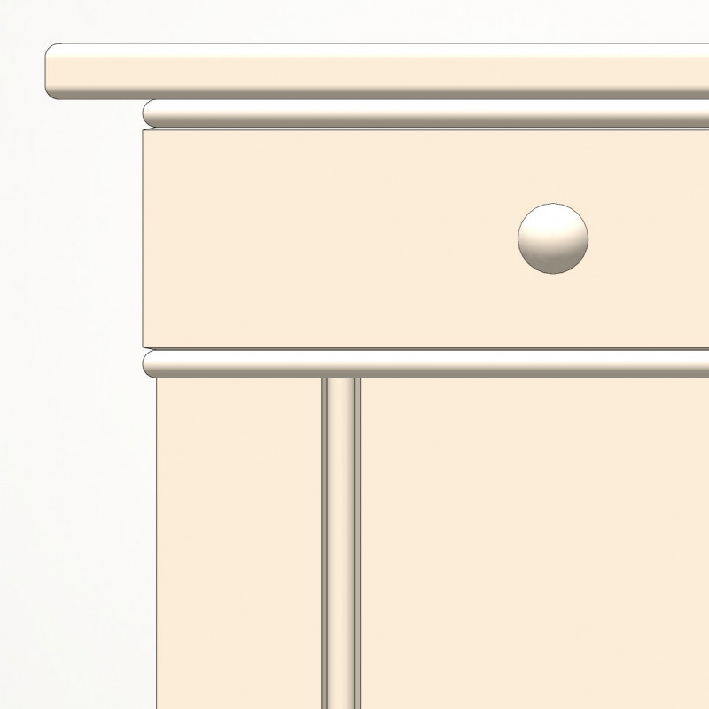

# P0017 - High pinstripe panel with shaker peg rail

This cladding looks very nice and is very practical.
Our Shaker Peg Rail is made in exactly the same shape as it can be found in the Shaker Museum Enfield.
The peg rail is a useful invention that allows you to keep things handy and organized, such as pots, scissors, dog leashes or to hang something on the wall, such as chairs, when you want to vacuum thoroughly.
The paneling can be ordered per linear meter. We manufacture the panel from solid wood in oak or pine. On request, it can be prepared for a colored coating.

## Technische Daten

- Referenz: P0017
- Preis: 700000000 €
- Verfügbar: 1
- Kategorie: Artikel, Hohe Vertäfelungen
- Sortierung: nan

## Varianten

- bezeichnung: Kiefer
  preis_aufschlag: 0
- bezeichnung: Eiche
  preis_aufschlag: 542000000

## Bilder

## SEO-Metadaten

- meta_title: {meta_title}
- meta_description: {meta_description}

## Tags

{tags}
