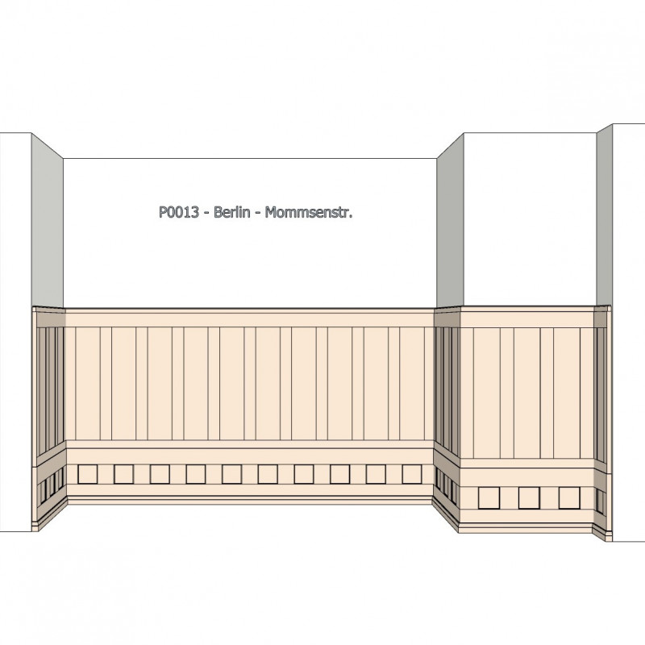
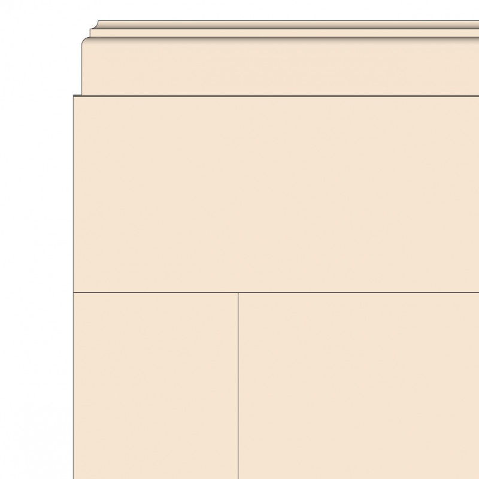

*** slug: "p0013" product_id: "53" reference: "P0013" titel: "P0013 - Berlin - Mommsenstraà e" kategorie: "Artikel, Hohe Vertäfelungen" beschreibung: >   Die Berliner Mommsenstraà e liegt zwischen Kantstraà e und KurfÃ1⁄4rstendamm in einem sehr mondänen, schicken Wohnviertel mit vielen Galerien und Boutiquen.  Die hier gezeigte Vertäfelung Ã1⁄4berzeugt durch ihren gleichmäà igen Rhythmus. Sie lässt sich besonders gut farblich gestalten. meta_title: "Hohe Vertäfelung mit doppelreihiger Kassetten" meta_description: "Vertäfelung â  Berlin Mommsenstr.â   â " hohe Wandvertäfelung im Stil der Jahrhundertwende. Bausatz in Kiefernholz fÃ1⁄4r klassische Interieurs und Altbauten" bilder:   - p0013-01.png   - p0013-02.png   - p0013-03.png   - p0013-04.png   - p0013-05.png   - p0013-06.png   - p0013-07.png   - p0013-08.png   - p0013-09.png bilder_alt:   - "GrÃ1⁄4nderzeit Wandvertäfelung Mommsenstraà e Berlin Charlottenburg 1700 mm hoch in Eiche oder Kiefer Historische GrÃ1⁄4nderzeit Vertäfelung Berlin Charlottenburg mit vertikalen Paneelen und Kassettensockel"   - "GrÃ1⁄4nderzeit Vertäfelung Berlin Mommsenstraà e historische Wandgestaltung mit vertikalen Paneelen und Kassettensockel Historische Wandvertäfelung Mommsenstraà e Berlin Charlottenburg Raumansicht mit durchgehender Paneelgliederung"   - "GrÃ1⁄4nderzeit Vertäfelung Mommsenstraà e Berlin historische Holzverkleidung mit klar gegliederten Paneelen Historische Wandvertäfelung Berlin Charlottenburg Eckansicht mit vertikalen Paneelfeldern und Kassettensockel"   - "Detail der GrÃ1⁄4nderzeit Vertäfelung Mommsenstraà e Berlin obere Abschlussleiste mit klarer Profilierung historische Holzvertäfelung Historische Wandvertäfelung Berlin Charlottenburg Detailansicht der vertikalen Paneelfelder und des profilierten Abschlusses"   - "Detail der GrÃ1⁄4nderzeit Vertäfelung Mommsenstraà e Berlin Sockelzone mit querrechteckigen Kassetten und profiliertem Abschluss Historische Wandvertäfelung Berlin Charlottenburg Detailansicht des unteren Bereichs mit fein gegliederter Kassettierung"   - "Detail GrÃ1⁄4nderzeit Vertäfelung Mommsenstraà e Berlin obere Abschlusszone mit profiliertem Gesims und Paneelstruktur Historische Wandvertäfelung Berlin Charlottenburg Detailansicht oberer Bereich mit Gesimsprofil und klassischer Gliederung"   - "Sockeldetail GrÃ1⁄4nderzeit Vertäfelung Mommsenstraà e Berlin klassischer Profilabschluss mit massiver Sockelleiste Historische Wandvertäfelung Berlin Charlottenburg Detailansicht Sockel mit profiliertem Abschluss und massiver Holzleiste"   - "Historische Wandvertäfelung im Eingangsbereich Mommsenstraà e Berlin dunkles Holz klassizistischer Flur mit DoppeltÃ1⁄4r"   - "Detail historische Wandvertäfelung Mommsenstraà e Berlin dunkles Holz rechteckige Kassettenfelder Ã1⁄4ber Fliesenboden" price: "964,29 €" verfuegbar: "1" varianten_yaml: |   - bezeichnung: Kiefer, Bausatz     preis_aufschlag: 0,00 €   - bezeichnung: Eiche, Bausatz     preis_aufschlag: 685,84 € tags: [] sortierung: "" langcode: "" author: "Tobias Klaus" author_url: "https://www.vertaefelungen.de/de/content/4-uber-uns" license: "CC BY-SA 4.0" source: "https://www.vertaefelungen.de/de/hohe-vertaefelungen/53-291-berlin-mommsenstr.html#/47-holzart-kiefer/55-bausatz-bausatz" last_updated: "2025-08-20" ***  # P0013 - Berlin - Mommsenstraà e  Die Berliner Mommsenstraà e liegt zwischen Kantstraà e und KurfÃ1⁄4rstendamm in einem sehr mondänen, schicken Wohnviertel mit vielen Galerien und Boutiquen.  Die hier gezeigte Vertäfelung Ã1⁄4berzeugt durch ihren gleichmäà igen Rhythmus. Sie lässt sich besonders gut farblich gestalten.  ## Technische Daten  - Referenz: P0013 - Preis: 964,29 € - Verfügbar: 1 - Kategorie: Artikel, Hohe Vertäfelungen - Sortierung:   ## Varianten    - bezeichnung: Kiefer, Bausatz     preis_aufschlag: 0,00 €   - bezeichnung: Eiche, Bausatz     preis_aufschlag: 685,84 €  ## Bilder            ## SEO-Metadaten  - meta_title: Hohe Vertäfelung mit doppelreihiger Kassetten - meta_description: Vertäfelung â  Berlin Mommsenstr.â   â " hohe Wandvertäfelung im Stil der Jahrhundertwende. Bausatz in Kiefernholz fÃ1⁄4r klassische Interieurs und Altbauten  ## Tags  _keine Tags hinterlegt_ 