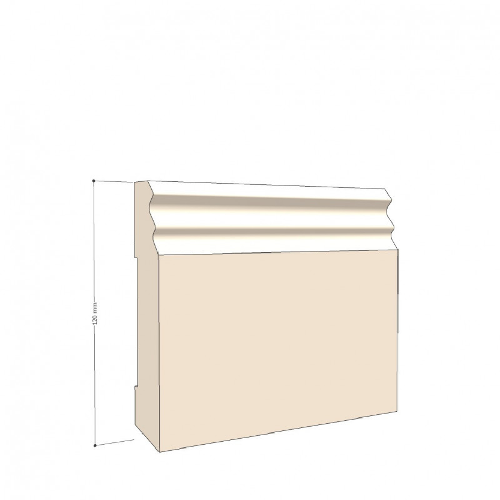

*** slug: "sl0002" product_id: "41" reference: "SL0002" titel: "SL0002 - Hamburger Leiste 120/18" kategorie: "Artikel, Sockelleisten" beschreibung: >   Hamburger oder Berliner Leiste? Beides ist das gleiche. Leider ist die Herkunft der Begriffe nicht genauer zu belegen. Wir finden, dass sich dieses formschöne Profil auch in Dresden oder Augsburg einsetzen lässt. meta_title: "Hamburger Leiste, 12 cm Höhe" meta_description: "Hamburger oder Berliner Leiste - beides das Gleiche! Wir bieten diese Fuà leiste mit einer Höhe von 12 cm." bilder:   - sl0002-1.png   - sl0002-2.png bilder_alt:   - "Sockelleiste Hamburger Leiste 25/120 mit geschwungener Profilkante"   - "Höhe 120 mm" price: "27,88 €" verfuegbar: "1" varianten_yaml: |     [] tags: [] sortierung: "" langcode: "" author: "Tobias Klaus" author_url: "https://www.vertaefelungen.de/de/content/4-uber-uns" license: "CC BY-SA 4.0" source: "https://www.vertaefelungen.de/de/sockelleisten/41-hamburger-leiste-18-120.html" last_updated: "2025-08-20" ***  # SL0002 - Hamburger Leiste 120/18  Hamburger oder Berliner Leiste? Beides ist das gleiche. Leider ist die Herkunft der Begriffe nicht genauer zu belegen. Wir finden, dass sich dieses formschöne Profil auch in Dresden oder Augsburg einsetzen lässt.  ## Technische Daten  - Referenz: SL0002 - Preis: 27,88 € - Verfügbar: 1 - Kategorie: Artikel, Sockelleisten - Sortierung:   ## Varianten      []  ## Bilder     ## SEO-Metadaten  - meta_title: Hamburger Leiste, 12 cm Höhe - meta_description: Hamburger oder Berliner Leiste - beides das Gleiche! Wir bieten diese Fuà leiste mit einer Höhe von 12 cm.  ## Tags  _keine Tags hinterlegt_ 